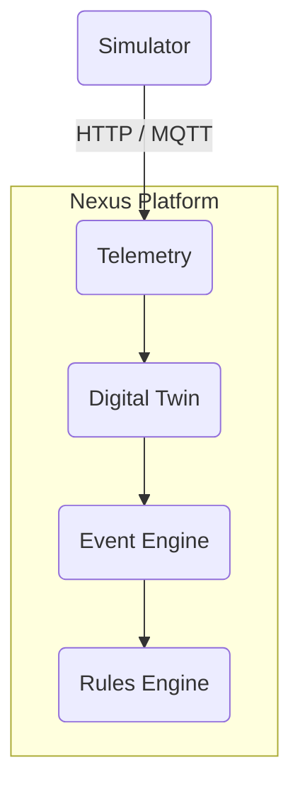
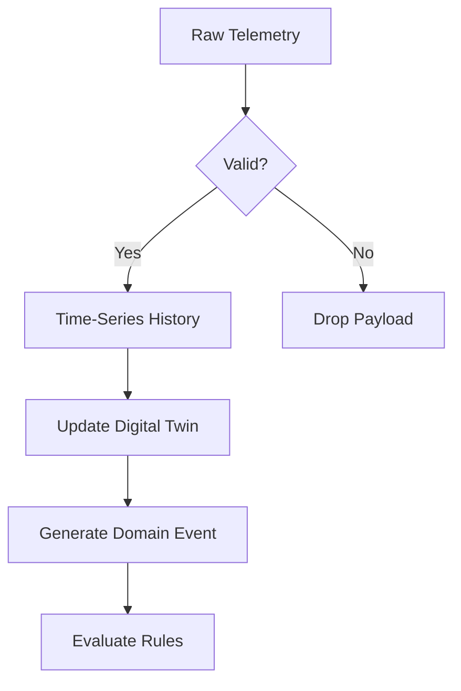
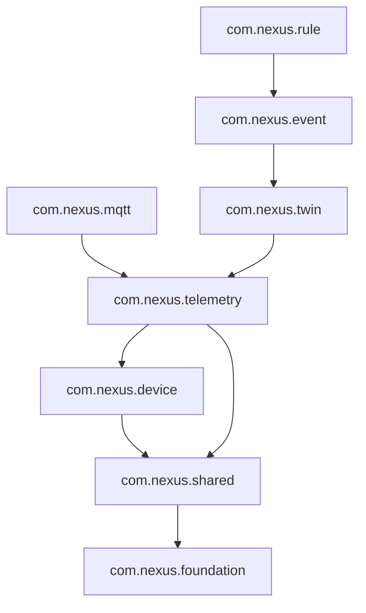
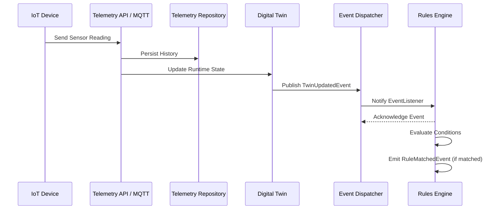

# NEXUS Architecture Diagrams

## Overall System Context

```mermaid
flowchart TD
    S(Simulator) -->|HTTP / MQTT| T(Telemetry)
    T --> D(Digital Twin)
    D --> E(Event Engine)
    E --> R(Rules Engine)
    
    subgraph Nexus Platform
    T
    D
    E
    R
    end
```

## Ingestion Flow

```mermaid
flowchart TD
    Telemetry[Raw Telemetry] --> Validation{Valid?}
    Validation -->|Yes| History[Time-Series History]
    Validation -->|No| Drop[Drop Payload]
    History --> Twin[Update Digital Twin]
    Twin --> Event[Generate Domain Event]
    Event --> Rule[Evaluate Rules]
```

## Package Boundaries

```mermaid
flowchart TD
    Foundation[com.nexus.foundation]
    Shared[com.nexus.shared]
    
    Device[com.nexus.device]
    Telemetry[com.nexus.telemetry]
    Mqtt[com.nexus.mqtt]
    Twin[com.nexus.twin]
    Event[com.nexus.event]
    Rule[com.nexus.rule]
    
    Device --> Shared
    Telemetry --> Device
    Telemetry --> Shared
    Mqtt --> Telemetry
    Twin --> Telemetry
    Event --> Twin
    Rule --> Event
    
    Shared --> Foundation
```

## Runtime Flow

```mermaid
sequenceDiagram
    participant Device as IoT Device
    participant API as Telemetry API / MQTT
    participant Repo as Telemetry Repository
    participant Twin as Digital Twin
    participant Dispatcher as Event Dispatcher
    participant Rule as Rules Engine
    
    Device->>API: Send Sensor Reading
    API->>Repo: Persist History
    API->>Twin: Update Runtime State
    Twin->>Dispatcher: Publish TwinUpdatedEvent
    Dispatcher->>Rule: Notify EventListener
    Rule-->>Dispatcher: Acknowledge Event
    Rule->>Rule: Evaluate Conditions
    Rule->>Rule: Emit RuleMatchedEvent (if matched)
```
